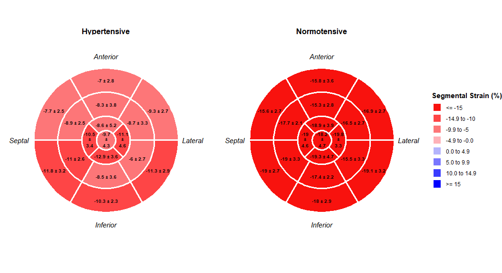

# beheart

The goal of `beHeart` is to simplify the creation of bull’s eye plots
for left ventricle segmental data, supporting both 16- and 17-segment
models. It provides functions to visualize raw or summarized data,
including comparisons between groups.

## Installation

You can install the development version of beheart from
[GitHub](https://github.com) with:

``` r
# install.packages("devtools")
devtools::install_github("sagomezo/beheart")
```

## Example

Here is a complete example showing how to prepare and plot data for two
groups, creating a publication-quality figure with a single command.

``` r
library(beHeart)

# 1. Start with "wide" data (one row per subject)
set.seed(42)
n_subjects <- 40
wide_dataset <- data.frame(
  subject_id = paste0("SUBJ_", 1:n_subjects),
  hypertension = sample(c("Yes", "No"), n_subjects, replace = TRUE),
  basal_ant = rnorm(n_subjects, -15, 3),
  basal_antsept = rnorm(n_subjects, -16, 3),
  basal_infsept = rnorm(n_subjects, -19, 3),
  basal_inf = rnorm(n_subjects, -18, 3),
  basal_inflat = rnorm(n_subjects, -19, 3),
  basal_antlat = rnorm(n_subjects, -17, 3),
  mid_ant = rnorm(n_subjects, -16, 3),
  mid_antsept = rnorm(n_subjects, -17, 3),
  mid_infsept = rnorm(n_subjects, -19, 3),
  mid_inf = rnorm(n_subjects, -17, 3),
  mid_inflat = rnorm(n_subjects, -15, 3),
  mid_antlat = rnorm(n_subjects, -16, 3),
  apical_ant = rnorm(n_subjects, -18, 4),
  apical_sept = rnorm(n_subjects, -19, 4),
  apical_inf = rnorm(n_subjects, -20, 4),
  apical_lat = rnorm(n_subjects, -19, 4),
  apex = rnorm(n_subjects, -17, 5)
)
wide_dataset[wide_dataset$hypertension == "Yes", 3:19] <-
  wide_dataset[wide_dataset$hypertension == "Yes", 3:19] + 8

# 2. Define the map from column names to segment numbers
segment_name_map <- c(
  "basal_ant" = 1, "basal_antsept" = 2, "basal_infsept" = 3,
  "basal_inf" = 4, "basal_inflat" = 5, "basal_antlat" = 6,
  "mid_ant" = 7, "mid_antsept" = 8, "mid_infsept" = 9,
  "mid_inf" = 10, "mid_inflat" = 11, "mid_antlat" = 12,
  "apical_ant" = 13, "apical_sept" = 14, "apical_inf" = 15,
  "apical_lat" = 16, "apex" = 17
)

# 3. Reshape the data to the required "long" format
long_dataset <- prepare_bullseye_data(
  data = wide_dataset,
  segment_map = segment_name_map,
  id_cols = c("subject_id", "hypertension"),
  values_to = "strain_value"
)

# 4. Create the final, faceted plot
plot_bullseye_from_df(
  df = long_dataset,
  group_col = segment,
  value_col = strain_value,
  facet_by = hypertension,
  facet_labels = c("Yes" = "Hypertensive", "No" = "Normotensive"),
  palette = "echo",
  value_name = "Segmental Strain (%)"
)
```


