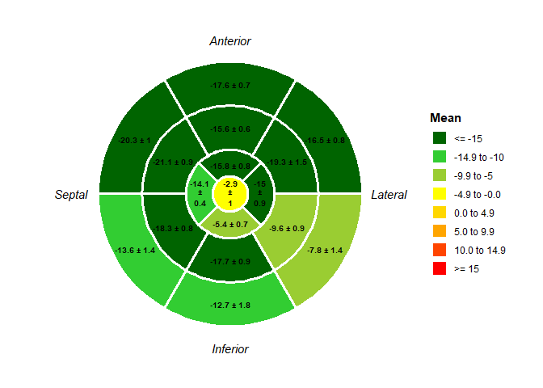
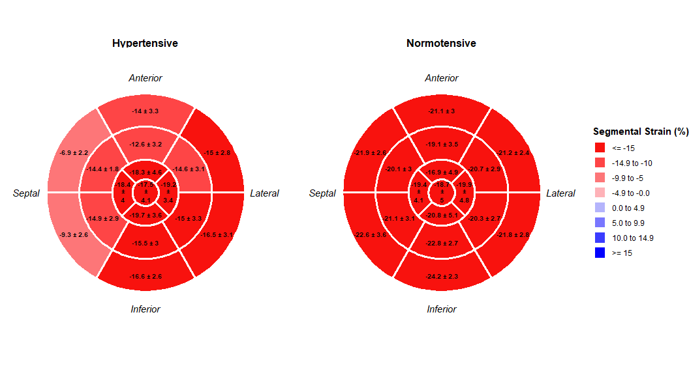
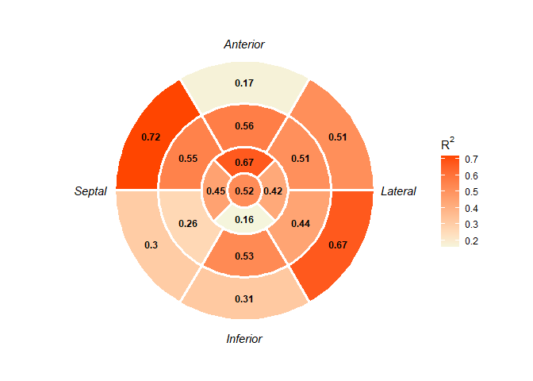

# beHeart

The goal of `beHeart` is to simplify the creation of bull’s eye plots
for left ventricle segmental data, supporting both 16- and 17-segment
models. It provides functions to visualize raw or summarized data,
including comparisons between groups.

## Installation

You can install the development version of beHeart from
[GitHub](https://github.com) with:

``` r
# install.packages("devtools")
devtools::install_github("sagomezo/beHeart")
```

## The `beHeart` Workflow

Visualizing your data with `beHeart` is a simple two-step process:

1.  **Prepare Your Data**: Get your data into the correct “long” format.
2.  **Plot**: Use one of the plotting functions to create your bull’s
    eye plot.

### Step 1: Understanding and Preparing Your Data

The main plotting function, `plot_bullseye_from_df()`, requires data in
a **long format**. This means you need a data frame with (at minimum)
two columns:

- A **segment column**: This tells the package which of the 17 segments
  the measurement belongs to. This column must contain numbers from 1 to
  17.
- A **value column**: This contains the actual measurement for that
  segment (e.g., a strain value).

#### From “Wide” to “Long” with `prepare_bullseye_data()`

Most clinical datasets are in a **wide format**, with one row per
patient and a separate column for each of the 17 segments. `beHeart`
provides a helper function, `prepare_bullseye_data()`, to easily convert
this into the required long format.

Here’s how it works:

``` r
library(beHeart)

# 1. Start with your "wide" data (one row per subject)
# Your column names for the segments can be anything.
set.seed(42)
wide_dataset <- data.frame(
  subject_id = paste0("SUBJ_", 1:5),
  group = rep(c("A", "B"), length.out = 5),
  b_ant = rnorm(5, -18), b_as = rnorm(5, -21), b_is = rnorm(5, -14),
  b_inf = rnorm(5, -12), b_il = rnorm(5, -8), b_al = rnorm(5, -16),
  m_ant = rnorm(5, -16), m_as = rnorm(5, -20), m_is = rnorm(5, -18),
  m_inf = rnorm(5, -18), m_il = rnorm(5, -10), m_al = rnorm(5, -19),
  a_ant = rnorm(5, -16), a_sept = rnorm(5, -15), a_inf = rnorm(5, -5),
  a_lat = rnorm(5, -15), apex = rnorm(5, -3)
)

print(head(wide_dataset))
#>   subject_id group     b_ant      b_as      b_is     b_inf      b_il      b_al
#> 1     SUBJ_1     A -16.62904 -21.10612 -12.69513 -11.36405 -8.306639 -16.43047
#> 2     SUBJ_2     B -18.56470 -19.48848 -11.71335 -12.28425 -9.781308 -16.25727
#> 3     SUBJ_3     A -17.63687 -21.09466 -15.38886 -14.65646 -8.171917 -17.76316
#> 4     SUBJ_4     B -17.36714 -18.98158 -14.27879 -14.44047 -6.785325 -15.53990
#> 5     SUBJ_5     A -17.59573 -21.06271 -14.13332 -10.67989 -6.104807 -16.63999
#>       m_ant      m_as      m_is     m_inf       m_il      m_al     a_ant
#> 1 -15.54455 -21.71701 -17.79400 -17.56718  -9.678075 -18.72345 -16.36723
#> 2 -15.29516 -20.78446 -18.36106 -18.81139 -10.783839 -18.32071 -15.81477
#> 3 -14.96490 -20.85091 -17.24184 -16.55590  -8.424272 -18.91017 -15.41818
#> 4 -16.60893 -22.41421 -18.72670 -18.43145  -9.357101 -21.99309 -14.60026
#> 5 -15.49504 -19.96388 -19.36828 -17.34435  -9.910239 -18.71512 -16.72729
#>      a_sept     a_inf     a_lat      apex
#> 1 -13.69746 -6.043119 -14.41900 -1.487293
#> 2 -14.66415 -5.090186 -14.23182 -2.742079
#> 3 -13.96149 -4.376482 -14.53623 -2.911560
#> 4 -14.07927 -5.953523 -15.88578 -3.120897
#> 5 -14.27912 -5.542829 -16.09978 -4.194329

# 2. Create a "map" that links your column names to the standard 1-17 segment numbers.
segment_name_map <- c(
  "b_ant" = 1, "b_as" = 2, "b_is" = 3, "b_inf" = 4, "b_il" = 5, "b_al" = 6,
  "m_ant" = 7, "m_as" = 8, "m_is" = 9, "m_inf" = 10, "m_il" = 11, "m_al" = 12,
  "a_ant" = 13, "a_sept" = 14, "a_inf" = 15, "a_lat" = 16, "apex" = 17
)

# 3. Reshape the data
long_dataset <- prepare_bullseye_data(
  data = wide_dataset,
  segment_map = segment_name_map,
  id_cols = c("subject_id", "group"), # These columns will be kept
  values_to = "strain_value"          # The name of your new value column
)

# The data is now in the correct long format
print(head(long_dataset))
#> # A tibble: 6 × 4
#>   subject_id group segment strain_value
#>   <chr>      <chr>   <int>        <dbl>
#> 1 SUBJ_1     A           1       -16.6 
#> 2 SUBJ_1     A           2       -21.1 
#> 3 SUBJ_1     A           3       -12.7 
#> 4 SUBJ_1     A           4       -11.4 
#> 5 SUBJ_1     A           5        -8.31
#> 6 SUBJ_1     A           6       -16.4
```

The resulting `long_dataset` is now perfectly formatted for plotting.

### Step 2: Plotting Your Data

Once your data is in the long format, you can use
`plot_bullseye_from_df()` to create a huge variety of plots.

#### Example 1: Basic Plot

A simple call to create a plot summarizing the mean and standard
deviation for each segment.

``` r
plot_bullseye_from_df(
  df = long_dataset,
  group_col = segment,
  value_col = strain_value
)
```



#### Example 2: Faceted Plot with Customizations

The true power of `beHeart` is in comparing groups and customizing the
output. Here, we create a side-by-side plot comparing two groups, one
with hypertensive heart disease and controls, using the clinical “echo”
palette and custom labels.

``` r
# Create a complete sample dataset for this example
set.seed(42)
n_subjects <- 40
wide_dataset_full <- data.frame(
  subject_id = paste0("SUBJ_", 1:n_subjects),
  hypertension = sample(c("Yes", "No"), n_subjects, replace = TRUE, prob = c(0.5, 0.5)),
  b_ant = rnorm(n_subjects, -20, 3), b_as = rnorm(n_subjects, -21, 3),
  b_is = rnorm(n_subjects, -22, 3), b_inf = rnorm(n_subjects, -23, 3),
  b_il = rnorm(n_subjects, -22, 3), b_al = rnorm(n_subjects, -21, 3),
  m_ant = rnorm(n_subjects, -19, 3), m_as = rnorm(n_subjects, -20, 3),
  m_is = rnorm(n_subjects, -21, 3), m_inf = rnorm(n_subjects, -22, 3),
  m_il = rnorm(n_subjects, -21, 3), m_al = rnorm(n_subjects, -20, 3),
  a_ant = rnorm(n_subjects, -18, 4), a_sept = rnorm(n_subjects, -19, 4),
  a_inf = rnorm(n_subjects, -20, 4), a_lat = rnorm(n_subjects, -19, 4),
  apex = rnorm(n_subjects, -17, 5)
)

# --- Simulate hypertensive heart disease pattern ---
is_hypertensive <- wide_dataset_full$hypertension == "Yes"
basal_cols <- c("b_ant", "b_as", "b_is", "b_inf", "b_il", "b_al")
mid_cols <- c("m_ant", "m_as", "m_is", "m_inf", "m_il", "m_al")


wide_dataset_full[is_hypertensive, c(basal_cols, mid_cols)] <-
  wide_dataset_full[is_hypertensive, c(basal_cols, mid_cols)] + 6

wide_dataset_full[is_hypertensive, c("b_as", "b_is")] <-
  wide_dataset_full[is_hypertensive, c("b_as", "b_is")] + 7

# --- Reshape and Plot ---
segment_name_map_full <- c(
  "b_ant" = 1, "b_as" = 2, "b_is" = 3, "b_inf" = 4, "b_il" = 5, "b_al" = 6,
  "m_ant" = 7, "m_as" = 8, "m_is" = 9, "m_inf" = 10, "m_il" = 11, "m_al" = 12,
  "a_ant" = 13, "a_sept" = 14, "a_inf" = 15, "a_lat" = 16, "apex" = 17
)

long_dataset_full <- prepare_bullseye_data(
  data = wide_dataset_full,
  segment_map = segment_name_map_full,
  id_cols = c("subject_id", "hypertension"),
  values_to = "strain_value"
)

# Create the final, faceted plot
plot_bullseye_from_df(
  df = long_dataset_full,
  group_col = segment,
  value_col = strain_value,
  facet_by = hypertension,
  facet_labels = c("Yes" = "Hypertensive", "No" = "Normotensive"),
  palette = "echo",
  value_name = "Segmental Strain (%)"
)
```



#### Example 3: Plotting Pre-summarized Data

If you already have a single value for each segment (e.g., from a paper
or another analysis), you can use `plot_bullseye_from_vector()`.

``` r
# A vector of 17 correlation coefficients
correlation_values <- runif(17, 0.1, 0.8)

plot_bullseye_from_vector(
  data = correlation_values,
  model = 17,
  value_name = bquote(R^2), # Use bquote for special characters
  palette = c("beige", "orangered") # A simple continuous scale
)
```


